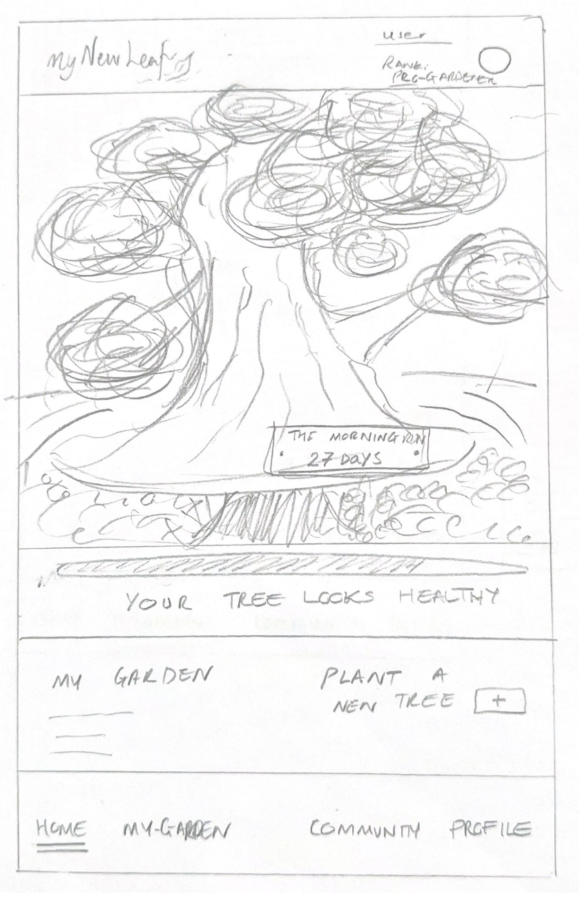
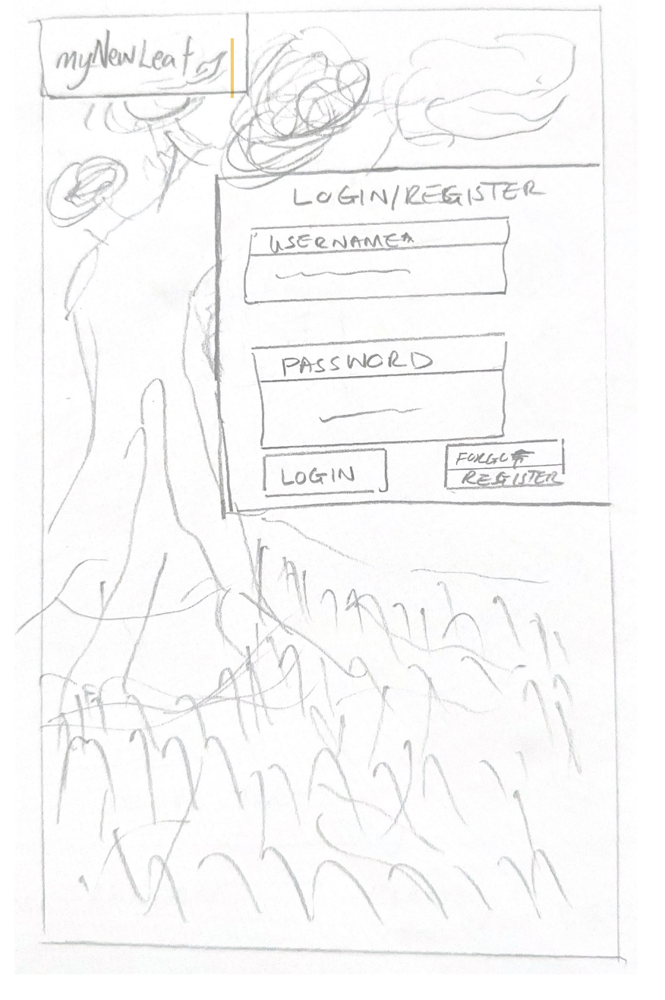
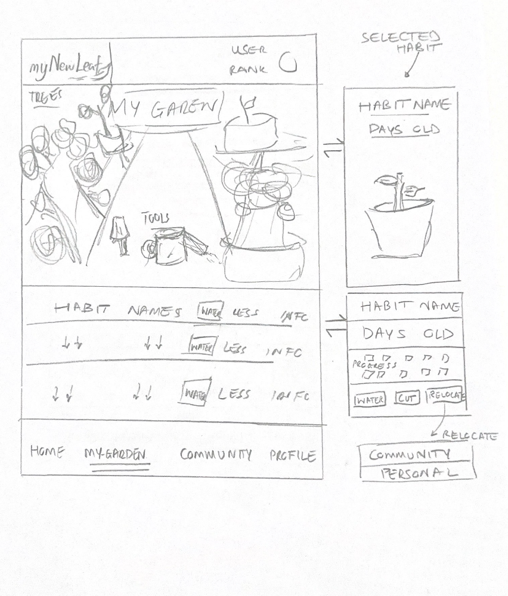
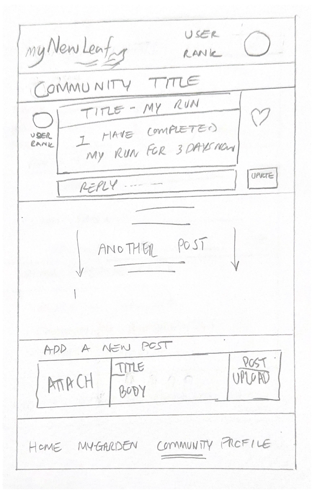
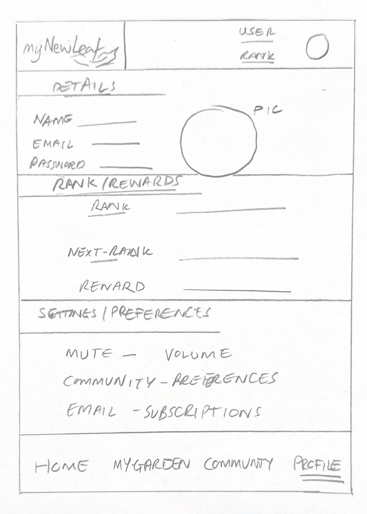

# myNewLeaf

## Overview

myNewLeaf: A Single Page Application (SPA) designed to help users cultivate positive habits and embark on personal growth journeys. It is an interactive personal growth and habit tracking application that combines elements of gamification and visual representation through a virtual bonsai tree. As users develop and maintain positive habits, their tree flourishes, providing a visual and interactive reflection of their progress. The platform also features a community aspect where users can interact, share their journey, and motivate each other, fostering a supportive environment for personal development.

### Problem

Existing habit tracking apps often lack engaging visual elements and community support, which are crucial for sustained habit formation. Users often struggle with motivation and accountability when trying to adopt new habits or break old ones.

- Visual Motivation: Many existing habit tracking apps only focus on lists or charts, lacking a visually engaging way to track progress. The virtual bonsai tree provides a unique and motivating visual representation as the tree evolves as users progress.

- Community: Developing and maintaining habits can be challenging without external support and motivation. The community aspect of the app allows users to connect with others on similar journeys, share successes and provide encouragement.

- Gamification: Gamification techniques, such as visually rewarding progress and achieving milestones can significantly increase user engagement to habit building.

- Holistic Approach to Personal Growth: By integrating personal growth with the nurturing of a virtual tree, encouraging users to see their habits as part of a larger journey.

- User-Centric Experience: Providing a seamless user interface and experience that integrates with daily routines, allowing users to take control of their habits and see tangible results.

### User Profile

- Individuals Seeking Personal Growth: People looking to cultivate positive habits such as exercise, meditation, reading, or productivity.

- Community-Oriented Users: Those interested in joining a supportive community to share progress, receive encouragement, and stay motivated.

- Gamification Enthusiasts: Users who are motivated by gamified elements like visual progress (e.g., growing a bonsai tree) and achieving milestones.

#### How Users Will Use It:

- Setting Goals: They will start by setting specific habits they want to develop or maintain, such as daily exercise or mindfulness practices.

- Tracking Progress: Users will track their daily progress within the app, marking when they complete their habits.

- Interacting with the Bonsai Tree: They will nurture a virtual bonsai tree that visually grows and flourishes as they consistently practice their habits. This interactive element serves as a motivational tool and visual representation of their progress.

- Engaging with the Community: Users can share updates on their journey, support others by commenting on their posts, and participate in community challenges or discussions.

- Receiving Feedback and Motivation: The app will provide feedback on progress, celebrate milestones, and send reminders to encourage users to stay on track with their habits.

#### Special Considerations:

- Accessibility: Ensure the app is accessible to users with disabilities, including those who rely on screen readers or have mobility impairments.

- Privacy and Security: Implement robust measures to protect user data, especially considering the personal nature of habit tracking and community interactions.

- Scalability: Design the app architecture to handle potential growth in user base and data volume as the community expands.

- User Experience Design: Prioritise intuitive navigation, clear visual cues, and responsive design to enhance usability and engagement.

### Features

- As a user, I want to be able to create new habits
- As a user, I want to be able to update my habits
- As a user, I want to be able to delete habits
- As a user, I want to be able to create community habits
- As a user, I want to be able to join community habits
- As a user, I want to be able to post motivational messages within community habits
- As a user, I want to be able to upvote motivational posts
- As a user, I want to be able to upvote community habits
- As a user, I want to create an account to manage my habits
- As a user, I want to log in to my account to track my habits
- As a user, I want to see my bonsai tree grow as I maintain my habits
- As a user, I want to add and update my profile bio
- As a user, I want to receive automated rank updates as I progress through habit formation
- As a user, I want to view gamified animations as I achieve new ranks

## Implementation

### Tech Stack

- Frontend:
  - React
  - JavaScript
  - Sass
  - HTML
- Backend:
  - Node.js
  - Express
  - MySQL
- Authentication:
  - Auth Validation
- RESTful APIs:
  - Custom endpoints for habit tracking, community interactions
- Deployment:
  - GitHub for version control, deployment automation

### APIs

API's maybe used later in the project to incorprate the gamification features, images, or connection to social media.

### Sitemap

- Home page
- View + Manage habits (Dashboard)
- Single Habit
- Community forum
- Profile page
- Register
- Login

### Mockups

#### Home Page

#### Register Page

#### Login Page

#### My-Garden Page

#### My-Tree Page

#### Community Page

#### My-Profile Page

### Data

#### MySQL Tables

#### Users Table

- id: INT, AUTO_INCREMENT, PRIMARY KEY
- username: VARCHAR(255), NOT NULL, UNIQUE
- password: VARCHAR(255), NOT NULL
- rank: INT, DEFAULT 0
- created_at: TIMESTAMP, DEFAULT CURRENT_TIMESTAMP
- updated_at: TIMESTAMP, DEFAULT CURRENT_TIMESTAMP

Explanation:

- id: Unique identifier for each user, automatically incremented.
- email: Unique email address used for account identification.
- password: Hashed password for security purposes.
- bio: Optional text field where users can provide a biography.
- rank: Integer representing user's rank or level within the system.
- created_at: Timestamp indicating when the user account was created.

#### Habits Table

- id: INT, AUTO_INCREMENT, PRIMARY KEY
- habit_name: VARCHAR(255), NOT NULL
- user_id: INT, FOREIGN KEY REFERENCES Users(id)
- created_at: TIMESTAMP, DEFAULT CURRENT_TIMESTAMP

#### Progress Table

- id: INT, AUTO_INCREMENT, PRIMARY KEY
- habit_id: INT, FOREIGN KEY REFERENCES Habits(id)
- created_at: TIMESTAMP, DEFAULT CURRENT_TIMESTAMP

#### CommunityPosts Table

- id: INT, AUTO_INCREMENT, PRIMARY KEY
- user_id: INT, FOREIGN KEY REFERENCES Users(id)
- post_description: TEXT, NOT NULL
- post_likes: INT, UNSIGNED, DEFAULT 0
- created_at: TIMESTAMP, DEFAULT CURRENT_TIMESTAMP
- updated_at: TIMESTAMP, DEFAULT CURRENT_TIMESTAMP

### Endpoints

All in Json format.

#### GET /habits

Get all habits, with an optional "user" if the user is logged in or not

Parameters:

- apiKey (optional-due to multi-access): apiKey used to fetch user-specific habits

Response:

- [
  {
  "id": 1,
  "habit_name": "Morning Run",
  "user_id": "user"
  },
  ...
  ]

#### GET /habits/:id

Get habit by id

Parameters:

- id: Habit id as number
- apiKey (optional): apiKey used to add user-specific information

Response:

- {
  "id": 1,
  ""name": "Morning Run"",
  "createdBy": "user",
  "community": false
  }

#### POST /habits

Create a new habit

Parameters:

- name: Habit name (required, max length 255)
- community: Boolean indicating if it is a community habit (optional, defaults to false)
- apiKey: apiKey of the logged in user (required)

Response:

- {
  "id": 1,
  ""name": "Morning Run"",
  "createdBy": "user",
  "community": false
  }

#### PUT /habits/:id

Update an existing habit

Parameters:

- id: Habit id (required)
- name: Habit name (optional, max length 255)
- community: Boolean indicating if it is a community habit (optional)
- apiKey: apiKey of the logged in user (required)

Response:

- {
  "id": 1,
  ""name": "Morning Run"",
  "createdBy": "user",
  "community": false
  }

#### DELETE /habits/:id

Delete an existing habit

Parameters:

- id: Habit id (required)
- apiKey: apiKey of the logged in user (required)

Response:

- {
  "message": ""
  }

#### GET /community

Get all communities, with an optional "user" if the user is logged in or not

Parameters:

- apiKey (optional-due to multi-access): apiKey used to fetch user-specific habits

Response:

- [
  {
  "id": 1,
  ""name": "Morning Run"",
  "createdBy": "user",
  },
  ...
  ]

#### GET /community/:id

Get community by id

Parameters:

- id: community id as number
- apiKey (optional): apiKey used to add user-specific information

Response:

- {
  "id": 1,
  ""name": "Morning Run"",
  "createdBy": "user",
  }

#### POST /community/:id/posts

Post a motivational message in a community habit

Parameters:

- habitId: Community habit id (required)
- message: Motivational message content (required)
- apiKey: apiKey of the logged in user (required)

Response:

- {
  "id": 1,
  "message": "Keep going!",
  "postedBy": "user"
  }

#### POST /community/:id/upvote

Upvote a community habit

Parameters:

- habitId: Community habit id (required)
- apiKey: apiKey of the logged in user (required)

Response:

- {
  "id": 1,
  ""name": "Morning Run"",
  "upvotes": 10
  }

#### POST /community/:id/posts/:id/upvote/

Upvote a motivational post

Parameters:

- habitId: Community habit id (required)
- postId: Post id (required)
- apiKey: apiKey of the logged in user (required)

Response:

- {
  "id": 1,
  "message": "Keep going!",
  "postedBy": "user",
  "upvotes": 5
  }

#### POST /users/register

Add a user account

Parameters:

- username: User's provided display name
- email: User's email (required, unique, valid email format)
- password: User's provided password (required, min length 8, numbers included, capital letters)
- bio: User's bio (optional)

Response:

- {
  "apiKey": "seyJhbGciOiJIUzI1NiIsInR5cCI6IkpXVCJ9.eyJzdWIiOiIxMjM0NTY3ODkwIiwibmFtZSI6I..."
  }

#### POST /users/login

Login a user

Parameters:

- email: User's email (required)
- password: User's provided password (required)

Response:

- {
  "apiKey": "seyJhbGciOiJIUzI1NiIsInR5cCI6IkpXVCJ9.eyJzdWIiOiIxMjM0NTY3ODkwIiwibmFtZSI6I..."
  }

#### PUT /users/:id/bio

Update user bio

Parameters:

- id: User id (required)
- bio: User's bio (required)
- apiKey: apiKey of the logged in user (required)

Response:

- {
  "id": 1,
  "email": "user@example.com",
  "bio": "This is my updated bio"
  }

### Auth

- Key Generation: Users receive a unique API key upon account creation.

- Usage: API key is included in request headers (Authorisation: ApiKey <your-api-key>).

- Server-side Validation: The server verifies the API key against its database to authenticate users and control access.

- Security:

  - API keys are treated as sensitive information and stored securely.
  - Mechanisms are in place for key revocation or regeneration if compromised.

- User Interface:
  Different UI states are managed based on API key validity, indicating whether the user is authenticated or not

## Roadmap

Setup Project Environment:

- Initialize frontend and backend repositories
- Set up initial project structure

Develop Habit Tracking Dashboard:

- Create UI components for habit tracking
- Implement CRUD operations for habits and progress logging

Integrating the virtual bonsai tree:

- Design animations for watering and growing the tree
- Design differen growth stages of the tree
- Add assets to file structure

Build Community Features:

- Design community forum UI and functionality
- Enable users to share progress and interact with posts

Implement User Authentication:

- Set up user registration and login functionalities
- Secure endpoints with API- key authentication

Testing and Bug Fixes:

- Conduct unit tests for critical functionalities
- Add validation where required
- Address user feedback and bug reports

Deployment and Optimisation:

- Deploy application to production environment
- Optimise performance and scalability

Continuous Improvement:

- Gather user analytics and feedback
- Plan and implement future updates based on user needs

## Nice-to-haves

- Mobile App Integration
- Advanced Gamification Features
- Ability to add custom reminders for habits
- Integration with External APIs (e.g., weather for mood tracking)
- Connection to social media to share progress
